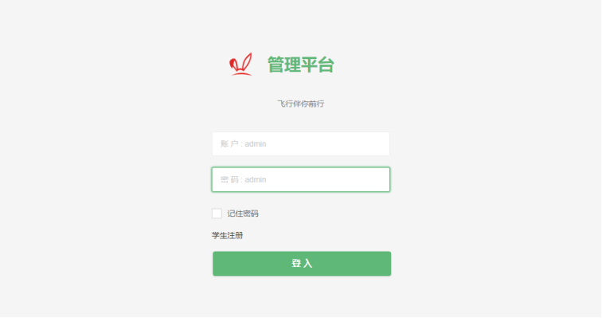
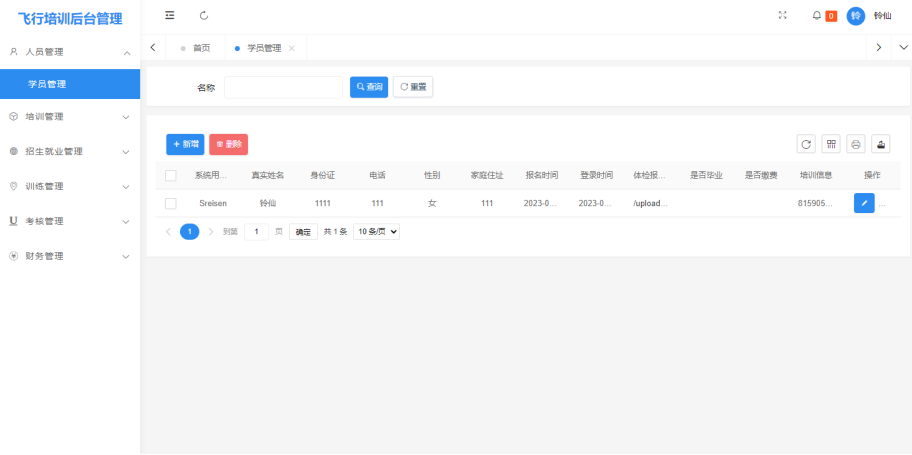

# 飞行培训学校管理系统


[](LICENSE)


## Table of Contents

- [Security](#security)
- [Background](#background)
- [Install](#install)
- [Usage](#usage)
- [API](#api)
- [Contributing](#contributing)
- [License](#license)

## Security

使用了sa-token进行安全认证

## Background

毕设做的项目，以下是论文的摘要
>  随着国内飞行运动的普及和人们生活水平的提高，各类飞行运动在国内兴起。飞行培训学校作为满足社会对飞行器驾驶资格需求的专业学校，面临着业务繁多和管理不规范等问题。为解决这些问题，可以通过引入管理系统来对飞行培训学校进行有效管理。
<br>本文通过对飞行培训学校的深入研究和分析，开发一个管理系统来进行综合管理。该系统的主要功能分为七个模块：人员管理模块、培训管理模块、招生就业管理模块、设施管理模块、训练管理模块、考核管理模块、财务管理模块。
<br>技术层面上采用Spring Boot技术构建系统的后端，前端则采用Thymeleaf模板引擎。数据库方面，采用MySQL作为数据存储，使用MyBatis作为后端持久层框架。
<br本系统具有良好的界面，对用户比较友好，具有性能好和低成本等特点，可以帮助飞行培训学校提高管理效率。

## Install


```
导入sql: pilot_school.sql
配置maven仓库: IDEA或vscode配置
启动redis: 需要下载 win reidis 下载完直接启动redis_cli即可
```


## Usage

### 目录结构
      src
        └── main             
             ├── java 
             │     └── com.fc
             │          ├── pilotSchool
             │          ├── PilotApplication.java
             │          └── PilotWebInitializer.java
             └── resource


      pilotSchool
        ├── common  
        │      ├── base  ··baseController baseService 和分页
        │      ├── conf      ························配置类
        │      ├── dataSource ····················数据源配置
        │      ├── domain   ··············前后台交互统一实体类
        │      ├── druid     ·····················德鲁伊配置
        │      ├── exception ····················全局异常处理
        │      ├── file     ························文件处理
        │      ├── interceptor ····················拦截器配置
        │      ├── log      ························日志处理
        │      ├── quartz   ························定时任务
        │      ├── spring   ·······················bean工厂
        │      └── support  ·····················数据转换方法
        ├── controller      ··························控制层
        ├── mapper          ·······················mapper层
        ├── model           ··························实体类
        ├── satoken         ·······················token配置
        ├── service         ·······················service层
        └── util            ····························工具

             
             





## API

## Contributing

See [the contributing file](CONTRIBUTING.md)!

PRs accepted.

Small note: If editing the Readme, please conform to the [standard-readme](https://github.com/RichardLitt/standard-readme) specification.


## License

[MIT © Richard McRichface.](../LICENSE)

## About me

